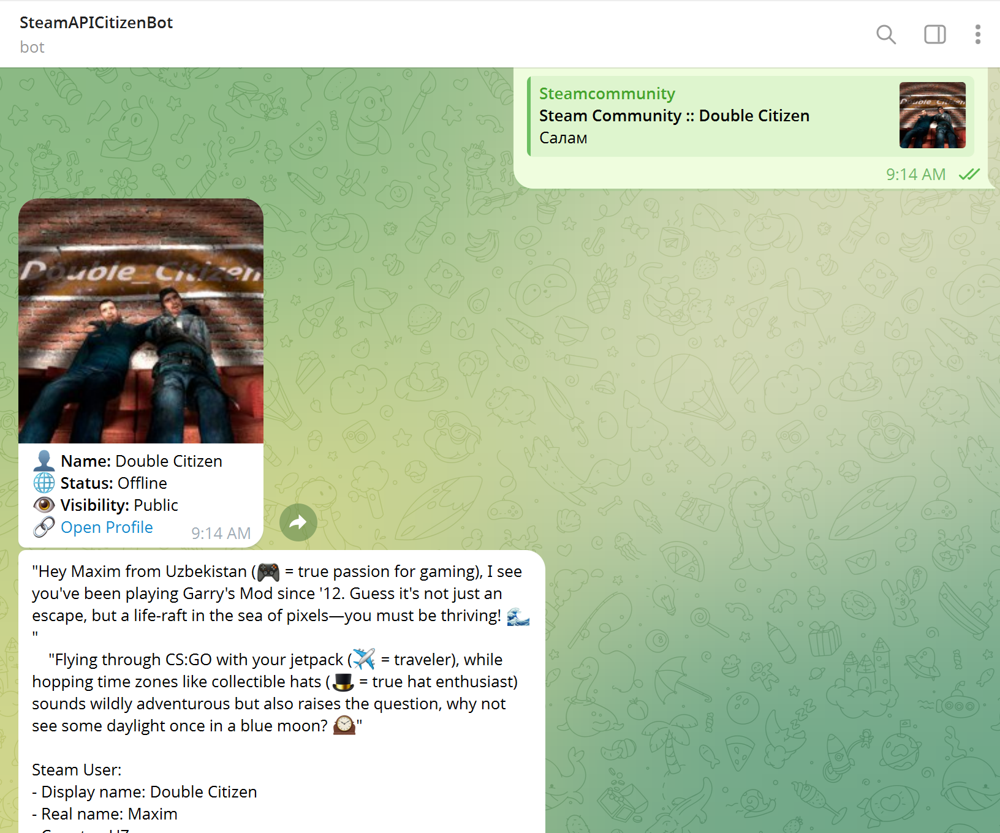

# 🎮 SteamInfoAboutUser

A sleek Telegram bot that provides detailed Steam profile information, friend statistics, and gaming activity. It even features a cheeky, AI-powered roast of your gaming habits!

 


## ✨ Features

- **Profile Overview**: Get instant access to display names, real names, country information, and account age.
- **Friend Insights**: See total friend counts and a breakdown of where your Steam friends are from.
- **Gaming Activity**: View your most played games and total playtime (from a sample of your profile).
- **AI Roast**: Integrated with **Ollama (Phi-3 Mini)** to provide a sarcastic, meme-filled roast of your Steam profile.
- **Flexible Search**: Works with SteamID64, vanity URLs, or just your custom nickname.

## 🛠️ Technology Stack

- **Python**: Core logic and bot framework.
- **python-telegram-bot**: High-level interface for the Telegram Bot API.
- **Steam Web API**: Data source for profile and gaming information.
- **Ollama (Phi-3 Mini)**: Local LLM for generating cheeky roasts.
- **Docker & Docker Compose**: For seamless containerized deployment.

## 🚀 Getting Started

### Prerequisites

- [Docker](https://www.docker.com/) and Docker Compose installed.
- A Telegram Bot Token (get it from [@BotFather](https://t.me/BotFather)).
- A Steam API Key (get it from [Steam Community](https://steamcommunity.com/dev/apikey)).

### Installation

1. **Clone the repository**:
   ```bash
   git clone https://github.com/DoubleCitizen/SteamInfoAboutUser.git
   cd SteamInfoAboutUser
   ```

2. **Configure environment variables**:
   Create a `.env` file in the root directory:
   ```env
   TELEGRAM_BOT_TOKEN=your_telegram_bot_token
   STEAM_API_KEY=your_steam_api_key
   ```

3. **Deploy with Docker Compose**:
   ```bash
   docker-compose up --build -d
   ```
   *Note: On the first run, the bot will wait for Ollama to start and download the `phi3:mini` model (approx. 2.3GB).*

## 📖 Usage

1. Open your Telegram bot.
2. Send the `/start` command.
3. Provide a SteamID, a profile URL, or a custom nickname.
4. Enjoy your profile summary and prepare for the roasting!

## 🤝 Contribution

Contributions are welcome! Feel free to open an issue or submit a pull request.

## 📝 License

This project is licensed under the MIT License.
